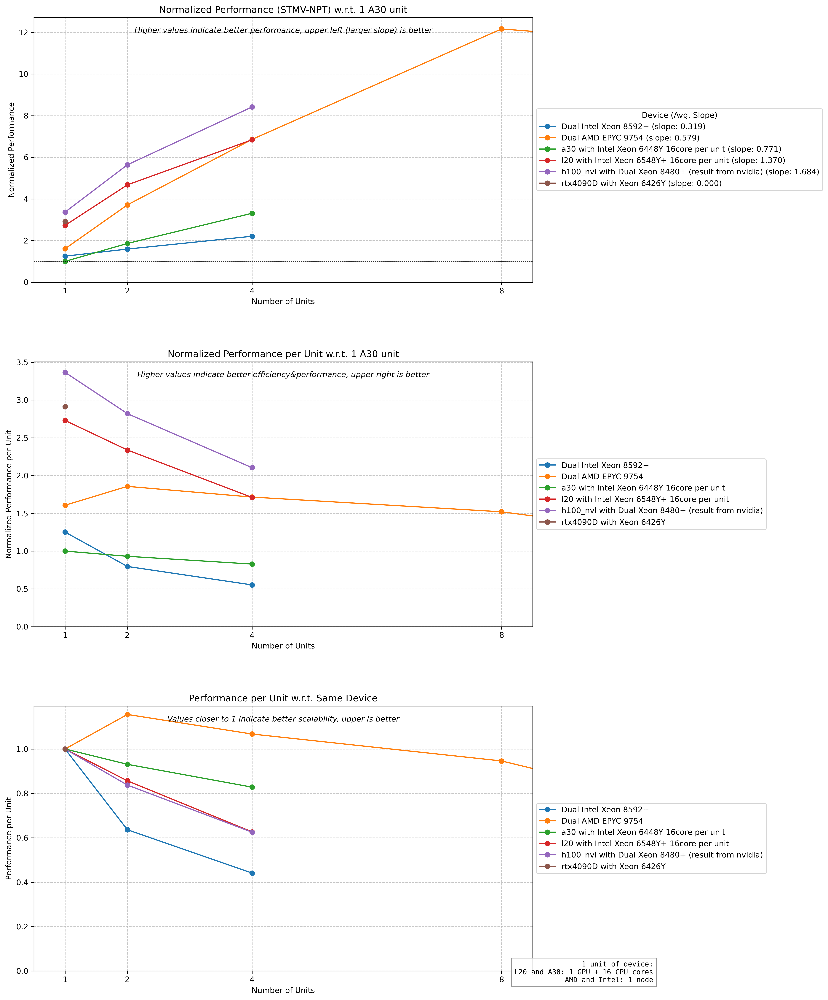
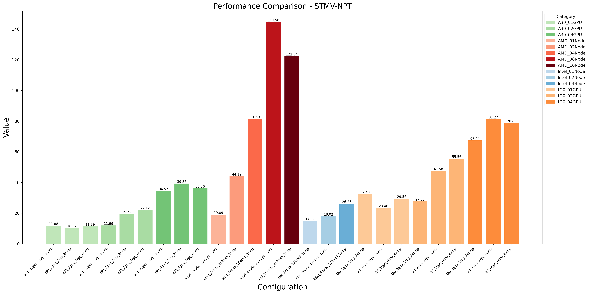

Running GROMACS on HPC Systems
=============================

.. container:: header

  | Last updated: 2024-12-06
  | *Solution under review*

.. index:: gromacs, gpu, molecular dynamics, hpc, cuda, singularity, spack

Environment
-----------

  - ITSC HPC4 Cluster 
  - GROMACS versions:
    - Container-based: 2023.2 (NGC)
    - Source build: 2024.1
  - CUDA 12.4.0
  - GCC 13.2.0
  - OpenMPI
  - Apptainer/Singularity for containers

Issue
-----

  - Need to run molecular dynamics simulations using GROMACS
  - Want to leverage GPU acceleration for faster simulations
  - Unsure which deployment method to choose:

    - NGC container (fastest for single node)
    - Source build (needed for multi-node jobs)

Resolution
----------

SLURM Job Template
~~~~~~~~~~~~~~~~~~

Create a SLURM job script with appropriate resource requests:

.. code-block:: bash

    #SBATCH --job-name=gromacs
    #SBATCH --nodes=1
    #SBATCH --ntasks-per-node=1
    #SBATCH --cpus-per-gpu=16
    #SBATCH --gpus-per-node=l20:4
    #SBATCH --partition=gpu-l20
    #SBATCH --account=<account>
    #SBATCH --time=01:00:00

1. Using NGC Container (Recommended for Single-Node Jobs)
~~~~~~~~~~~~~~~~~~~~~~~~~~~~~~~~~~~~~~~~~~~~~~~~~~~~~~~

* Add these commands to your SLURM script:

.. code-block:: bash

    export GMX_ENABLE_DIRECT_GPU_COMM=1
    
    singularity run --nv \
      -B <simulation_dir>:/host_pwd \
      --pwd /host_pwd \
      docker://nvcr.io/hpc/gromacs:2023.2 \
      gmx mdrun -maxh 1.0 -ntmpi 8 -ntomp 8 \
      -nb gpu -pme gpu -npme 1 -update gpu \
      -bonded gpu -dlb no -nstlist 300 -pin on

.. note::
    NGC container provides superior performance for single-node jobs

2. Building from Source with Spack (For Multi-Node Jobs)
~~~~~~~~~~~~~~~~~~~~~~~~~~~~~~~~~~~~~~~~~~~~~~~~~~~~~~~~~~

* Set up Spack environment:

.. code-block:: bash

    spack env create gromacs
    spack env activate gromacs
    
    # Install GROMACS
    spack add gromacs@2024.1%gcc@13.2.0 +mpi +cuda cuda_arch=89 ^cuda@12.4.0 ^openmpi
    spack concretize -fU && spack install --only-concrete

* Add these commands to your SLURM script:

.. code-block:: bash
    
    spack env activate gromacs
    gmx_mpi <commands>

Performance Considerations
~~~~~~~~~~~~~~~~~~~~~~~~

* Hardware Performance Comparison:

* Combined Hardware-Threading Performance:

Key findings:
  - One NVIDIA L20 GPU per job typically provides optimal cost-effectiveness
  - NGC container outperforms source builds for single-node jobs
  - Performance depends heavily on:

    - Number of MPI threads (ntmpi)
    - Number of OpenMP threads (ntomp)
    - Neighbor search frequency (nstlist)

.. warning::
    Always benchmark your specific simulation setup to determine optimal resource allocation

Root Cause
----------

GROMACS performance depends heavily on build configuration and runtime parameters. NGC containers are pre-optimized for single-node performance, while source builds provide flexibility needed for multi-node runs.

Reference
---------

- NVIDIA NGC GROMACS Container: https://catalog.ngc.nvidia.com/orgs/hpc/containers/gromacs
- GROMACS Documentation: http://manual.gromacs.org/
- Spack Documentation: https://spack.readthedocs.io/

----

.. container:: footer

  **HPC Support Team**
    | ITSC, HKUST
    | Email: cchelp@ust.hk
    | Web: https://itsc.ust.hk

  **Article Info**
    | Issued: 2024-12-06
    | Issued by: chtaihei@ust.hk