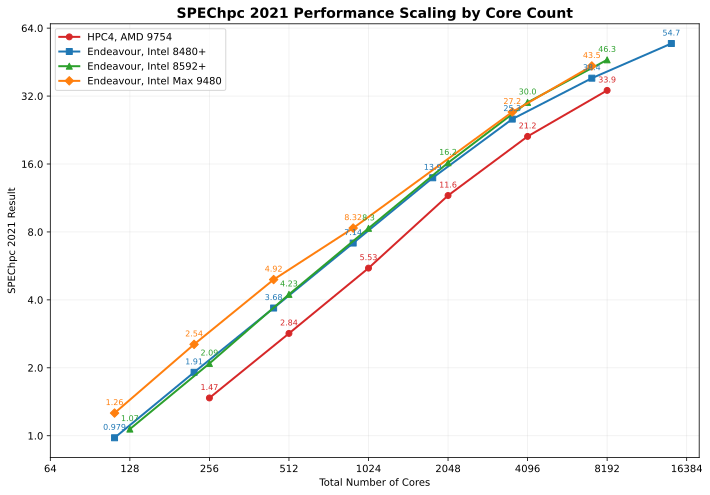
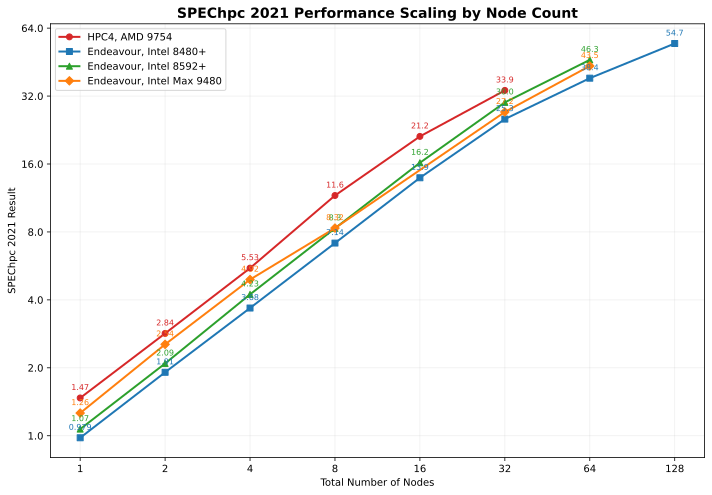

=======================
Performance Benchmarks
=======================

This page presents the performance benchmarks of our HPC systems using SPEC HPC 2021, demonstrating the computational capabilities and scalability of our infrastructure.

Overview
========

We provide two types of benchmark results:

1. **Single-Node Performance (SPEC HPC 2021 Tiny)**: Demonstrates the performance characteristics of individual compute nodes across different hardware vendors and configurations, ensuring consistent performance regardless of vendor choice.

2. **Multi-Node Scalability (SPEC HPC 2021 Small)**: Shows the scaling efficiency of our primary compute platform across multiple nodes, illustrating how performance scales with additional resources.

All benchmark results include detailed hardware specifications, software stack information, and the exact command-line parameters used to achieve these results, enabling reproducibility and transparency.

Single-Node Performance
========================

SPEC HPC 2021 Tiny Benchmark Results
-------------------------------------

These benchmarks demonstrate single-node performance across different hardware configurations, executed with various parallelization strategies (MPI, OpenMP) and job submission methods (bare-metal, SLURM).

Dell PowerEdge R6625 (AMD EPYC 9754)
^^^^^^^^^^^^^^^^^^^^^^^^^^^^^^^^^^^^^

The Dell R6625 systems powered by AMD EPYC 9754 processors represent our primary compute platform.

.. list-table::
   :header-rows: 1
   :widths: 15 20 10 10 20 25

   * - Scheduling
     - Parallelization
     - Ranks
     - Threads
     - Base Score
     - Full Report
   * - Bare-metal
     - MPI
     - 256
     - 1
     - 13.5
     - :download:`[pdf] <spechpc2021/dell-r6625-amd9754.tiny.mpi.bm.oneapi-impi.n1.pdf>`
   * - SLURM
     - MPI
     - 256
     - 1
     - 12.8
     - :download:`[pdf] <spechpc2021/dell-r6625-amd9754.tiny.mpi.slurm.oneapi-impi.n1.pdf>`
   * - SLURM
     - MPI+OpenMP
     - 32
     - 8
     - 14.9
     - :download:`[pdf] <spechpc2021/dell-r6625-amd9754.tiny.omp.slurm.oneapi-impi.n1.pdf>`

Gigabyte R183 (AMD EPYC 9754)
^^^^^^^^^^^^^^^^^^^^^^^^^^^^^^

The Gigabyte R183 systems also feature AMD EPYC 9754 processors, demonstrating vendor-neutral performance.

.. list-table::
   :header-rows: 1
   :widths: 15 20 10 10 20 25

   * - Scheduling
     - Parallelization
     - Ranks
     - Threads
     - Base Score
     - Full Report
   * - SLURM
     - MPI
     - 256
     - 1
     - 12.4
     - :download:`[pdf] <spechpc2021/giga-r183-amd9754.tiny.mpi.slurm.oneapi-impi.n1.pdf>`
   * - SLURM
     - MPI+OpenMP
     - 32
     - 8
     - 15.0
     - :download:`[pdf] <spechpc2021/giga-r183-amd9754.tiny.omp.slurm.oneapi-impi.n1.pdf>`

Key Observations
^^^^^^^^^^^^^^^^

- Both Dell and Gigabyte platforms deliver consistent performance with the same AMD EPYC 9754 processors
- No significant performance degradation observed across different vendors
- SLURM job scheduler introduces minimal overhead compared to bare-metal execution
- Both MPI and OpenMP parallelization strategies are well-supported

Multi-Node Scalability
=======================

SPEC HPC 2021 Small Benchmark Results
--------------------------------------

These benchmarks demonstrate the scaling characteristics of our primary compute platform (Dell R6625 with AMD EPYC 9754) using hybrid MPI+OpenMP parallelization across multiple nodes.

Scaling Results by Node Count
^^^^^^^^^^^^^^^^^^^^^^^^^^^^^^

.. list-table::
   :header-rows: 1
   :widths: 12 15 8 10 10 20 25

   * - Scheduling
     - Parallelization
     - Nodes
     - Ranks
     - Threads
     - Base Score
     - Full Report
   * - SLURM
     - MPI+OpenMP
     - 1
     - 32
     - 8
     - 1.47
     - :download:`[pdf] <spechpc2021/dell-r6625-amd9754.small.omp.slurm.oneapi-ompi.n1.pdf>`
   * - SLURM
     - MPI+OpenMP
     - 2
     - 64
     - 8
     - 2.84
     - :download:`[pdf] <spechpc2021/dell-r6625-amd9754.small.omp.slurm.oneapi-ompi.n2.pdf>`
   * - SLURM
     - MPI+OpenMP
     - 4
     - 128
     - 8
     - 5.53
     - :download:`[pdf] <spechpc2021/dell-r6625-amd9754.small.omp.slurm.oneapi-ompi.n4.pdf>`
   * - SLURM
     - MPI+OpenMP
     - 8
     - 256
     - 8
     - 11.6
     - :download:`[pdf] <spechpc2021/dell-r6625-amd9754.small.omp.slurm.oneapi-ompi.n8.pdf>`
   * - SLURM
     - MPI+OpenMP
     - 16
     - 512
     - 8
     - 21.2
     - :download:`[pdf] <spechpc2021/dell-r6625-amd9754.small.omp.slurm.oneapi-ompi.n16.pdf>`
   * - SLURM
     - MPI+OpenMP
     - 32
     - 1024
     - 8
     - 33.9
     - :download:`[pdf] <spechpc2021/dell-r6625-amd9754.small.omp.slurm.oneapi-ompi.n32.pdf>`

Scalability Analysis
====================

The following plots compare our system's scalability against published results from other HPC centers.

Core Count Scaling
-------------------

This plot shows how performance scales as the number of CPU cores increases within our system, compared to published results from other facilities.

Node Count Scaling
-------------------

This plot demonstrates scaling efficiency as additional compute nodes are added to the job, illustrating the effectiveness of our interconnect and parallel I/O infrastructure.

Reproducing Results
====================

All PDF reports contain the complete configuration details needed to reproduce these results, including:

- Exact command-line invocations
- Environment variables and module configurations
- SLURM job scripts and parameters
- Compiler and linker flags
- MPI process and OpenMP thread configurations

Users can reference these reports to optimize their own applications or validate expected performance on our systems.

Notes
=====

- All benchmarks were conducted under production system conditions
- Results represent typical performance users can expect
- Performance may vary based on workload characteristics, I/O patterns, and system load
- For questions about these benchmarks or performance optimization assistance, please contact our HPC support team
