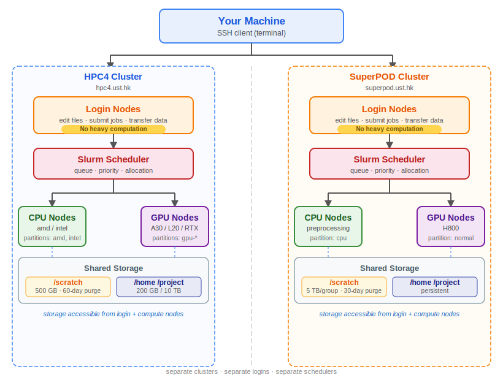
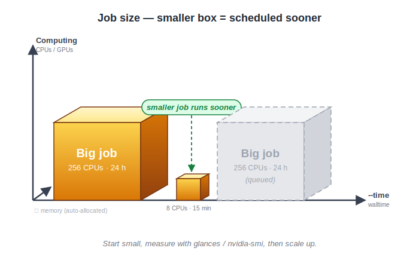

Quick Start
===========

.. meta::
    :description: Quick-start onboarding for new HPC4 and SuperPOD users covering access, storage, software setup, and first SLURM jobs.
    :keywords: HPC4, SuperPOD, quick start, onboarding, SLURM, software environment, storage

.. rst-class:: header

    | Last updated: 2026-06-04

Use this page as the main onboarding entry for new HPC users.
If you received a welcome email with your initial credentials,
keep that email handy as you follow this guide.

This quick-start covers both **HPC4** (``hpc4.ust.hk``) and
**SuperPOD** (``superpod.ust.hk``).

Official pages for partition details, quotas, policies, and
announcements:

- `HPC4 <https://itso.hkust.edu.hk/services/academic-teaching-support/high-performance-computing/hpc4>`__
- `SuperPOD <https://itso.hkust.edu.hk/services/academic-teaching-support/high-performance-computing/superpod>`__

.. _understanding-the-cluster:

Understanding the Cluster
--------------------------

What is an HPC cluster?
~~~~~~~~~~~~~~~~~~~~~~~

A cluster is many computers (*nodes*) connected by a high-speed network
and managed as a single shared system.  Hundreds of people use it at the
same time.

- **Login nodes** — where you land when you SSH in.  Shared by everyone.
  Use them only for editing files, light compiling, submitting jobs, and
  transferring data.  **Do not run heavy computations on login nodes** —
  they will be killed by the system administrators.

- **Compute nodes** — the machines that actually run your work.  They
  come in CPU-only and GPU-equipped variants.  You never SSH directly to
  them; instead you submit jobs to the scheduler.

- **Storage** — network-mounted file systems shared across all nodes.
  Tier-1 (``/scratch``) is fast but temporary.  Tier-2 (``/home``,
  ``/project``) is backed-up and meant for long-term data.  Quotas and
  retention policies differ between HPC4 and SuperPOD; see the official
  pages linked above.

The scheduler: Slurm
~~~~~~~~~~~~~~~~~~~~

Both HPC4 and SuperPOD use **Slurm** to manage access to compute nodes.

**How it works, in plain English**

You do not run big programs on the login node.
Instead, you write a *batch script* describing what resources you need
(CPUs, memory, time) and which commands to run.  You hand that script to
Slurm with ``sbatch``.  Slurm returns a **job ID immediately** — you can
log out, go home, the job will run when resources are free.

::

    $ sbatch my_job.sh
    Submitted batch job 123456

    $ squeue --me
      JOBID  PARTITION  NAME     USER  ST  TIME  NODES
     123456  amd        my_job   user  PD   0:00  1

    # ... later, when the job finishes ...

    $ cat slurm-123456.out

That is the entire mental model.  The rest of this section explains the
details.

**Workflow**

.. mermaid:: slurm-flow.mmd
   :alt: Slurm workflow: ① You → sbatch → ② Queue → schedule → ③ Scheduler → allocate → ④ Job runs → ⑤ Output files. Development loop: test small → check → debug/scale → resubmit.
   :align: center

**Recommended workflow: start small, then scale up**

.. mermaid:: slurm-dev-loop.mmd
   :alt: Development cycle: test with small job → inspect output → fix errors or scale up resources → repeat.
   :align: center

The most common beginner mistake is requesting too many resources.
Start with a tiny test, inspect the output, and only scale up when
you are sure everything works.

**Job size — smaller box = scheduled sooner**

A job is a box of resources × memory × time.  Smaller boxes fit into
gaps that larger jobs cannot use — this is called *backfill scheduling*.
Start small, measure resource utilization with ``glances`` or ``nvidia-smi``, then scale up.

**How to choose your first resource request**

.. list-table::
   :header-rows: 1

   * - Resource
     - Start with
     - Slurm flag
     - Scale up if
   * - CPUs
     - 4
     - ``--cpus-per-task=4``
     - your code uses more cores
   * - Memory
     - auto-allocated
     - *do not set* (both clusters allocate automatically)
     - job is killed by OOM
   * - GPUs
     - 0 (CPU job) or ≥1 (GPU job)
     - ``--gpus-per-node=1``
     - your code uses GPU libraries

.. note::

   On both HPC4 and SuperPOD, **do not set** ``--mem`` or ``--mem-per-cpu``.
   Memory is allocated proportionally based on the number of CPUs or GPUs
   requested.  Setting it manually can conflict with the scheduler.

**Useful commands**

.. list-table::
   :header-rows: 1

   * - Command
     - Purpose
   * - ``sbatch script.sh``
     - Submit a job
   * - ``squeue --me``
     - Check your jobs
   * - ``sacct -j <jobid>``
     - Job history / resource usage
   * - ``scancel <jobid>``
     - Cancel a job

**How to check if your job succeeded**

.. code-block:: text

    $ squeue --me                # while waiting/running
      JOBID  PARTITION  NAME     USER  ST  TIME  NODES
     123456  amd        my_job   user  R    2:30  1

    $ sacct -j 123456            # after job finishes
      JobID    State    ExitCode  Elapsed
      123456   COMPLETED  0       00:02:30

    $ cat slurm-123456.out       # check your output
    Hello from cpu42

Cluster vs your laptop
~~~~~~~~~~~~~~~~~~~~~~

+----------------------+----------------------+-----------------------------+
|                      | Your laptop          | HPC4 / SuperPOD             |
+======================+======================+=============================+
| Who uses it          | You alone            | Shared by hundreds of users |
+----------------------+----------------------+-----------------------------+
| Starting work        | Open a terminal      | Submit a job via ``sbatch`` |
+----------------------+----------------------+-----------------------------+
| Getting results      | Immediately          | After the job runs (queued) |
+----------------------+----------------------+-----------------------------+
| Software             | Install anything     | Load via ``module`` commands|
+----------------------+----------------------+-----------------------------+
| File system          | Local SSD            | Network-mounted (NFS)       |
+----------------------+----------------------+-----------------------------+
| GPUs                 | Usually 0–1          | Many, shared via scheduler  |
+----------------------+----------------------+-----------------------------+

Key differences between HPC4 and SuperPOD
~~~~~~~~~~~~~~~~~~~~~~~~~~~~~~~~~~~~~~~~~

+-----------------------------+-----------------------------------+------------------------------------+
|                             | HPC4                              | SuperPOD                           |
+=============================+===================================+====================================+
| Login host                  | ``hpc4.ust.hk``                   | ``superpod.ust.hk``                |
+-----------------------------+-----------------------------------+------------------------------------+
| Edge Spack                  | ``/opt/shared/.spack-edge``       | ``/scratch/spack/2025``            |
+-----------------------------+-----------------------------------+------------------------------------+
| Recommended approach        | Spack + Lmod modules              | Container-based (Enroot/Pyxis)     |
+-----------------------------+-----------------------------------+------------------------------------+
| GPU partitions              | ``gpu-a30``, ``gpu-l20``,         | ``normal``                         |
|                             | ``gpu-rtx5880``, ``gpu-rtx4090d`` |                                    |
+-----------------------------+-----------------------------------+------------------------------------+
| CPU partitions              | ``amd``, ``intel``                | ``cpu`` (preprocessing)            |
+-----------------------------+-----------------------------------+------------------------------------+

See :doc:`/software/software-support-overview` (HPC4) and :doc:`/kb/enroot/index`
(SuperPOD) for more detailed software documentation.

Acknowledgement
~~~~~~~~~~~~~~~

.. important::

   If your research makes use of HPC4 or SuperPOD, please include the
   appropriate acknowledgement in your publication, thesis, or
   presentation.  Also send a copy or URL of your work to the cluster
   support team.

   **HPC4**: *The computations in this work were performed on the High
   Performance Computing facilities, HKUST HPC4, provided by ITSO, The
   Hong Kong University of Science and Technology.*
   → ``hpc4support@ust.hk``

   **SuperPOD**: *The computations in this work were performed on the
   High Performance Computing facilities, HKUST SuperPOD, provided by
   ITSO, The Hong Kong University of Science and Technology (HKUST).*
   → ``spodsupport@ust.hk``

Use the pages below as the main onboarding path.
Each item includes a short description so readers can decide where to start.

.. toctree::
    :hidden:
    :maxdepth: 1
    :titlesonly:

    access-and-authentication
    data-and-storage
    software-environment
    first-job-template
    job-submission

.. grid:: 1 2 2 2
    :gutter: 2

    .. grid-item-card:: Access and Authentication
        :link: access-and-authentication
        :link-type: doc

        Start here if you need the login host, authentication flow, VPN expectations, or a quick check that your account access is ready.

    .. grid-item-card:: Data and Storage
        :link: data-and-storage
        :link-type: doc

        Use this page to understand where to store files, what each path is for, and how to move data in and out safely.

    .. grid-item-card:: Software Environment
        :link: software-environment
        :link-type: doc

        Read this when you need Python, compilers, MPI, or module commands, and want a practical starting point for the HPC software stack.

    .. grid-item-card:: Submit Your First Job
        :link: first-job-template
        :link-type: doc

        Follow this path for the shortest first success: create one small batch script, submit it, and confirm that it runs on a compute node.

    .. grid-item-card:: Job Templates and Control
        :link: job-submission
        :link-type: doc

        Continue here after the first batch job works and you need GPU, MPI, interactive ``srun``, or job-control commands such as ``squeue`` and ``scancel``.
