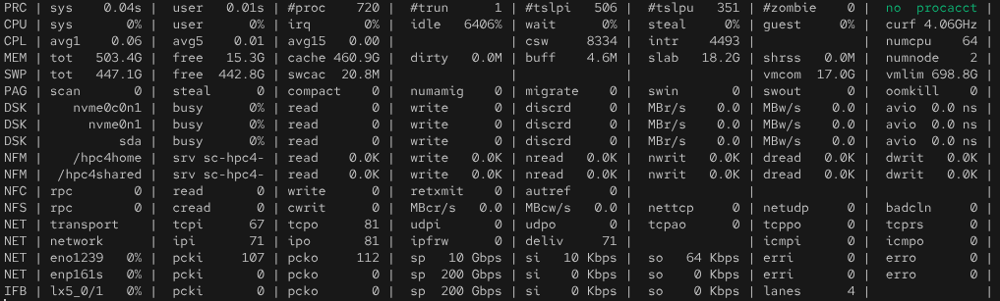

====
Atop
====

Atop is an advanced system and process monitor for Linux providing comprehensive resource utilization tracking with persistent logging capabilities. This document describes practical approaches for deploying atop in HPC environments and using it for post-mortem system diagnostics.

.. contents::
   :local:
   :depth: 2

Overview
========

Atop is a full-screen performance monitor combining real-time resource observation with persistent logging capabilities. Unlike traditional monitoring tools such as ``top``, atop records all process activity to disk, enabling post-mortem analysis of historical system states.

Value Proposition
-----------------

**Historical analysis capability:**
  - Persistent logging enables backtracking: "What consumed resources during yesterday's job failure?"
  - Daily compressed logs with configurable retention (default 28 days)
  - Crash-surviving logs ensure data availability even after system failures
  - 10-minute interval snapshots (configurable) balance granularity with storage overhead

**Complete process accounting:**
  - Records resource consumption of processes that completed during measurement intervals
  - Short-lived processes visible despite completing between observation intervals
  - Per-process CPU, memory, disk I/O, and network statistics (with netatop module)
  - User attribution tracks resource consumption per user

**Multi-resource coverage:**
  - Comprehensive tracking: CPU, memory, swap, disk I/O, network utilization
  - System-level and per-process granularity
  - cgroup-aware monitoring with pressure stall information (PSI)
  - Visual indicators highlight critical resource saturation

**Subsystem identification:**
  - Rapid identification of resource bottlenecks (CPU/memory/disk/network)
  - Localization before detailed tracing reduces diagnostic time
  - Serves as first-line diagnostic tool before invoking tracing utilities

**Limitations acknowledged:**
  - Sub-interval resolution limited: Transient issues lasting seconds may not appear in default 10-minute snapshots
  - No code-level detail: Identifies resource saturation but not specific functions or system calls
  - Historical logging only: Not a real-time alerting system (use Prometheus/Grafana for alerts)

Learning Curve
--------------

**Difficulty: Medium**

Atop's setup is straightforward - package installation and service activation complete within minutes. The learning challenge lies in mastering the extensive command set for different diagnostic scenarios. Atop provides dozens of interactive commands for view switching, process filtering, resource sorting, and time navigation.

System administrators may initially feel overwhelmed by interface density and command variety. Start with basic real-time observation (``atop`` with default view), then gradually explore historical log analysis (``atop -r``) and view switching (``m`` for memory, ``d`` for disk, ``n`` for network). Competency develops through repeated use across actual diagnostic scenarios rather than memorizing all available commands upfront.

**Recommendation:** Begin with simple log backtracking workflows: user reports issue → identify timestamp → review atop logs → identify resource bottleneck. Build intuition through repeated diagnostics before exploring advanced filtering and aggregation features.

Data Collection Model
=====================

Interval-Based Sampling
-----------------------

Atop employs interval-based sampling rather than continuous streaming. Every N seconds (default 600), atop captures a snapshot of system and process state, then compresses and writes this data to persistent storage.

**Default configuration:**

- **Interval:** 600 seconds (10 minutes)
- **Retention:** 28 days
- **Storage:** ~10-50 MB per day per system (compressed)
- **Location:** ``/var/log/atop/atop_YYYYMMDD``

**Interval trade-offs:**

- **Shorter intervals (60s, 120s):** Capture transient issues, increased overhead and storage
- **Longer intervals (900s, 1800s):** Reduce overhead, risk missing short-duration anomalies
- **Default 10 minutes:** Balances diagnostic utility with operational overhead for most HPC environments

Process Lifecycle Tracking
---------------------------

Atop records all processes active during each interval, including:

- **Running processes:** Currently executing at snapshot time
- **Finished processes:** Completed since previous snapshot (cumulative resource usage)
- **Zombie processes:** Terminated but not yet reaped by parent

This complete accounting ensures short-lived processes remain visible in logs despite completing between snapshots.

Installation and Setup
======================

Prerequisites
-------------

**Software requirements:**

- Linux operating system with systemd (RHEL/Rocky/AlmaLinux, Ubuntu/Debian, SUSE)
- Kernel 2.6.28 or later (for process accounting)
- zlib compression library (typically pre-installed)

**Storage requirements:**

- Compressed logs: 10-50 MB per day per system
- 28-day retention: ~1-2 GB per system
- Location: ``/var/log/atop/``

Package Installation
--------------------

**RHEL/Rocky/AlmaLinux:**

.. code-block:: bash

   # Install core atop package
   sudo dnf install atop

**Debian/Ubuntu:**

.. code-block:: bash

   # Install core atop package
   sudo apt install atop

Persistent Logging Configuration
---------------------------------

Atop requires systemd service activation to enable persistent logging. Without this configuration, atop functions only as a real-time monitoring tool.

.. code-block:: bash

   # Enable and start atop logging service
   sudo systemctl enable --now atop
   
   # Verify service status
   systemctl status atop
   
   # Check log directory
   ls -lh /var/log/atop/

**Verify logging is active:**

.. code-block:: bash

   # Current day's log should exist
   ls -lh /var/log/atop/atop_$(date +%Y%m%d)
   
   # View recent snapshot
   atop -r

Configuration Tuning
--------------------

Default retention is 28 days with 600-second (10-minute) intervals. Modify ``/usr/share/atop/atop.daily`` to adjust:

.. code-block:: bash

   # Retention period (number of daily logs to retain)
   LOGGENERATIONS=28
   
   # Sampling interval in seconds (default 600 = 10 minutes)
   LOGINTERVAL=600       # Reduce for finer granularity, increase for lower overhead

**Configuration trade-offs:**

- **Lower intervals (60s, 120s):** Capture transient issues, increased CPU overhead and storage
- **Higher intervals (900s, 1800s):** Reduced overhead, risk missing short-duration anomalies
- **Default 10 minutes:** Balances diagnostic utility with operational overhead

After modifying configuration, restart the service:

.. code-block:: bash

   sudo systemctl restart atop

Basic Usage
===========

Understanding Atop's Display
-----------------------------

Atop's interface consists of two main sections:

1. **System Resource Panel (upper):** Subsystem-level metrics (CPU, memory, disk, network)
2. **Process List (lower):** Per-process resource consumption

The recommended starting view combines fixed system resources with active process filtering:

.. code-block:: bash

   atop -f

The ``-f`` flag fixes the system resource panel at the top while allowing interactive process list navigation. This provides stable reference metrics while exploring process details.

**System Resource Panel:**

The panel displays interval statistics across multiple resource types:

- **PRC:** Process lifecycle (running, sleeping, zombie processes)
- **CPU:** CPU utilization breakdown (system, user, idle, wait)
- **CPL:** CPU load averages (1, 5, 15 minutes)
- **MEM:** Memory usage (total, free, cache, buffers, slab)
- **SWP:** Swap usage and virtual memory
- **PAG:** Page scanning and swapping activity
- **DSK:** Per-disk I/O statistics
- **NFM/NFC:** NFS mount statistics (if applicable)
- **NET:** Network interface and protocol statistics

System Resource Panel Metrics
------------------------------

**PRC (Process) Line:**

- ``sys``: Total system (kernel) CPU time consumed during interval
- ``user``: Total user-space CPU time consumed during interval
- ``#proc``: Total processes tracked (includes finished processes)
- ``#trun``: Currently running processes (actively executing on CPU)
- ``#tslpi``: Interruptible sleep - normal idle state
- ``#tslpu``: Uninterruptible sleep - blocked on I/O (high values indicate I/O bottlenecks)
- ``#zombie``: Zombie processes (usually harmless unless persistent)
- ``clones``: Process/thread creation rate per second

**CPU Line:**

- ``sys``: Percentage in system/kernel mode
- ``user``: Percentage in user mode
- ``irq``: Interrupt handling overhead
- ``idle``: Idle time (higher = less utilized)
- ``wait``: Waiting for disk I/O (high values indicate I/O saturation)
- ``steal``: CPU cycles stolen by hypervisor (virtualized environments)
- ``curf``: Current CPU frequency
- ``numcpu``: Number of CPUs

**MEM (Memory) Line:**

- ``tot``: Total physical memory
- ``free``: Unused memory
- ``cache``: Page cache (file system caching)
- ``dirty``: Modified pages not yet written to disk
- ``buff``: Buffer cache
- ``slab``: Kernel data structures
- ``slrec``: Reclaimable slab memory

**DSK (Disk) Line:**

- ``busy``: Percentage time disk was active
- ``read/write``: Operations per second
- ``MBr/s, MBw/s``: Throughput in MB/second
- ``avio``: Average I/O time (high values indicate slow disk)

**NET (Network) Lines:**

- ``transport``: TCP/UDP packet counts
- ``network``: IP layer statistics
- ``interface``: Per-interface packet rates and bandwidth
- ``sp``: Link speed
- ``si/so``: Incoming/outgoing bandwidth (Kbps, Mbps, Gbps)

Use Case: Real-Time Diagnostics
================================

Real-time monitoring identifies issues as they occur, providing immediate visibility into system behavior.

Launch Real-Time View
----------------------

Start atop with fixed system panel:

.. code-block:: bash

   atop -f

Interactive Navigation
----------------------

Once launched, use keyboard commands to explore:

**Resource view selection:**

- ``g``: Generic (default) - CPU and memory overview
- ``m``: Memory details - detailed memory consumption
- ``d``: Disk details - per-disk I/O statistics
- ``n``: Network details - network interface statistics
- ``c``: Command line - full process command lines

**Process sorting:**

- ``C``: Sort by CPU consumption
- ``M``: Sort by memory consumption
- ``D``: Sort by disk I/O
- ``A``: Sort by overall activity (automatic)

**Process filtering and aggregation:**

- ``u``: Aggregate by user - show per-user resource totals
- ``p``: Aggregate by program name - show per-application totals
- ``U``: Filter by specific user (prompts for username)
- ``P``: Filter by specific program (prompts for program name)

**Exit:**

- ``q``: Quit

Example: Identifying CPU Saturation
------------------------------------

User reports: "System feels slow right now"

1. Launch ``atop -f``
2. Observe CPU line: ``wait`` percentage high?
3. Cross-validate with related metrics:
   
   - **DSK line:** Check if any disk shows ``busy`` near 100%, high ``avio`` latency
   - **NFM/NFC lines:** If NFS is involved, check for high request rates or slow response
   - **PAG line:** Check for non-zero ``scan`` or ``stall`` (memory pressure causing swap I/O)

4. If disk I/O confirmed:
   
   - Press ``d`` to switch to disk view
   - Identify which disk (local or NFS mount) shows saturation
   - Press ``D`` to sort processes by disk I/O
   - Identify processes generating excessive I/O (read/write operations)

**Note:** High CPU ``wait`` with low disk ``busy`` may indicate network-mounted filesystem issues (NFS, SMB) where I/O requests queue remotely rather than at local disk.

Use Case: Post-Mortem Analysis
===============================

Atop's primary value for HPC diagnostics lies in historical log backtracking. When issues occurred in the past, atop logs enable root cause analysis.

Diagnostic Workflow
-------------------

User reports: "My job was slow yesterday at 14:30"

**Step 1: Load historical logs**

.. code-block:: bash

   # Yesterday's logs
   atop -r /var/log/atop/atop_$(date -d yesterday +%Y%m%d)
   
   # Specific date (example: December 15, 2025)
   atop -r /var/log/atop/atop_20251215

**Step 2: Navigate to timestamp**

After launching ``atop -r``:

- Press ``b`` (jump to specific time)
- Enter ``14:30`` when prompted
- System displays snapshot nearest to 14:30

**Step 3: Identify resource bottleneck**

Review system resource panel (top section):

- High CPU ``wait``? → Disk I/O issue
- Low ``free`` memory, high ``scan``? → Memory pressure
- High network interface ``busy``? → Network saturation
- High ``#tslpu``? → Processes blocked on I/O

**Step 4: Switch views for detail**

- Press ``m`` for memory details
- Press ``d`` for disk I/O details
- Press ``n`` for network details

**Step 5: Identify culprit process**

- Press ``C`` to sort by CPU
- Press ``M`` to sort by memory
- Press ``D`` to sort by disk I/O
- Press ``u`` to aggregate by user
- Press ``p`` to aggregate by program

**Step 6: Establish timeline**

- Press ``T`` to go backward in time
- Press ``t`` to go forward in time
- Observe when bottleneck started/ended

Time Navigation Commands
------------------------

- ``t``: Forward in time (jump to next snapshot)
- ``T``: Backward in time (jump to previous snapshot)
- ``b``: Jump to specific timestamp (prompts for time in HH:MM format)

Command-Line Filtering
-----------------------

Preset views and filters via command-line flags:

.. code-block:: bash

   # Sort by CPU during log review
   atop -r -C
   
   # Sort by memory
   atop -r -M
   
   # Sort by disk I/O
   atop -r -D
   
   # Show only specific user's processes
   atop -r -U username
   
   # Aggregate by program
   atop -r -p

Command-Line Options by Category
---------------------------------

Command-line options establish the initial view and behavior. All can be overridden interactively at runtime.

**Activity focus (select resource view):**

.. code-block:: bash

   atop -f      # Full system panel (all subsystems visible)
   atop -m      # Memory-focused view
   atop -d      # Disk I/O-focused view
   atop -n      # Network-focused view (requires netatop kernel module)
   atop -s      # Scheduling information (priority, nice, state)
   atop -v      # Various details (PPID, user/group, timestamps)
   atop -c      # Full command lines

**Sorting (process ordering):**

.. code-block:: bash

   atop -C      # Sort by CPU consumption (default)
   atop -M      # Sort by memory consumption
   atop -D      # Sort by disk I/O activity
   atop -N      # Sort by network I/O (requires netatop)
   atop -A      # Automatic sorting by most active resource

**Aggregation and filtering:**

.. code-block:: bash

   atop -u      # Aggregate by user (show per-user totals)
   atop -p      # Aggregate by program name (group identical commands)

**Display options:**

.. code-block:: bash

   atop -1      # Show per-second averages instead of interval totals
   atop -a      # Show all processes (including inactive)
   atop -y      # Show threads within processes
   
   atop 5       # Update every 5 seconds (last argument = interval)

**Common combinations:**

.. code-block:: bash

   # Memory investigation with per-second updates
   atop -f -m -A -1 1
   
   # Per-user CPU usage
   atop -u -C 2
   
   # Disk activity by program
   atop -p -D -1 1

Interactive Commands
--------------------

Atop supports runtime view switching via keyboard shortcuts:

**Resource view selection:**

- ``g``: Generic (default) - CPU and memory overview
- ``m``: Memory details - detailed memory consumption
- ``d``: Disk details - per-disk I/O statistics
- ``n``: Network details - network interface and per-process network (if netatop loaded)
- ``s``: Scheduling information - priority, policy, state
- ``v``: Various details - PPID, user/group, timestamps
- ``c``: Command line - full process command lines

**Process sorting:**

- ``C``: Sort by CPU consumption
- ``M``: Sort by memory consumption
- ``D``: Sort by disk I/O
- ``N``: Sort by network I/O (requires netatop)
- ``A``: Sort by overall activity (automatic)

**Process filtering:**

- ``u``: Aggregate by user - show per-user resource totals
- ``p``: Aggregate by program name - show per-application totals
- ``U``: Filter by specific user (prompts for username)
- ``P``: Filter by specific program (prompts for program name)

**Navigation:**

- ``t``: Forward in time (when viewing logs)
- ``T``: Backward in time (when viewing logs)
- ``b``: Jump to specific timestamp (when viewing logs)
- ``q``: Quit

Advanced Usage
==============

Per-Process Network Statistics (netatop)
-----------------------------------------

The optional ``netatop`` kernel module enables per-process network statistics, showing which process sends/receives network traffic. This requires kernel module compilation and loading.

**Note:** Most HPC diagnostic scenarios don't require per-process network attribution. System-level network statistics (available without netatop) suffice for identifying network saturation or interface issues. Per-process network tracking is rarely needed in practice.

**Skip netatop unless:**

- You need to identify which specific process generates network traffic
- Per-process network I/O attribution is critical for your use case
- System-level network statistics prove insufficient for diagnostics

If per-process network accounting is required, consult official documentation at https://atoptool.nl/ for installation instructions. The module requires kernel headers, compilation tools, and careful integration with system kernel updates.

Best Practices
==============

Operational Guidelines
----------------------

**Interval selection:**

- Default 10 minutes balances diagnostic utility with overhead
- Reduce to 2-5 minutes for systems with frequent transient issues
- Increase to 15-30 minutes for stable systems with storage constraints

**Log retention:**

- Default 28 days provides good coverage for most diagnostic needs
- Increase for systems requiring longer historical analysis
- Compress old logs externally if extending retention beyond defaults

**Storage management:**

- Monitor ``/var/log/atop/`` disk usage
- Allocate 1-2 GB per system for 28-day retention
- Consider centralized log collection for multi-system environments

**Integration with diagnostic workflows:**

1. **Real-time issues:** Start with monitoring dashboards (Prometheus/Grafana)
2. **Historical issues:** Start with atop logs
3. **Atop identifies culprit:** Use tracing tools (strace, perf) for code-level detail
4. **System-wide issues:** Investigate hardware/kernel (journalctl, dmesg)

**Limitations awareness:**

- Atop logs interval snapshots, not continuous streams
- Transient issues lasting seconds may not appear in logs
- For sub-interval resolution, use continuous tracing (perf record, eBPF)

References and Resources
=========================

Official Documentation
----------------------

- **Main documentation:** https://atoptool.nl/ - Official project site with manpages, feature descriptions, and configuration guides
- **Screenshots and visual guide:** https://atoptool.nl/screenshots.php - Annotated examples of various atop views
- **System reports and usage examples:** https://atoptool.nl/systemreports.php - Real-world output interpretation patterns
- **Source repository:** https://github.com/Atoptool/atop - Issue tracking and development

Additional Resources
--------------------

- **Man pages:** ``man atop``, ``man atopsar`` (included with package) - Authoritative reference for all options
- **Related diagnostic tools:** :doc:`../index` - Overview of complementary validation and tracing tools
